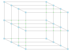

# FTensorKit

Construct Fermionic Tensor Network elegantly. Input a Lattice, give out an eincode.

Warning: still under development...

## To start

clone this repo and run pluto and open notebook 

## Gallery

### The origin Tensor Network generated by a given lattice


### The Fermionic Tensor Network generated by adding swapgates



### Labels, which provide information to permute input tensor


The eincode is

```julia
EinCode{((1, 2, 3), (1, 4, 5), (2, 6, 7, 8), (9, 10, 11, 12), (6, 13, 14), (15, 16, 17), (3, 18, 19, 20), (4, 21, 22, 23), (7, 24, 25, 26, 27), (9, 28, 29, 30, 31), (13, 32, 33, 34), (15, 35, 36, 37), (18, 38, 39, 40), (21, 41, 42, 43), (24, 44, 45, 46, 47), (28, 48, 49, 50, 51), (32, 52, 53, 54), (35, 55, 56, 57), (38, 58, 59), (41, 60, 61), (44, 62, 63, 64), (48, 60, 65, 66), (52, 67, 68), (55, 65, 67), (5, 19, 22, 69), (8, 20, 25, 70), (10, 29, 71, 72), (14, 26, 33, 73), (39, 69, 74, 75), (40, 70, 76, 77), (30, 78, 79, 80), (23, 42, 74, 78), (71, 81, 82, 83), (45, 73, 84, 85), (36, 86, 87, 88), (31, 49, 81, 86), (37, 89, 90, 91), (34, 53, 84, 89), (11, 58, 75, 79), (12, 59, 76, 92), (43, 50, 61, 80), (16, 62, 82, 87), (17, 63, 85, 90), (51, 56, 66, 88), (54, 57, 68, 91), (27, 46, 77, 93), (72, 92, 93, 94), (47, 64, 83, 94)), ()}
```

You can contract this eincode by using [OMEinsum.jl](https://github.com/under-Peter/OMEinsum.jl).